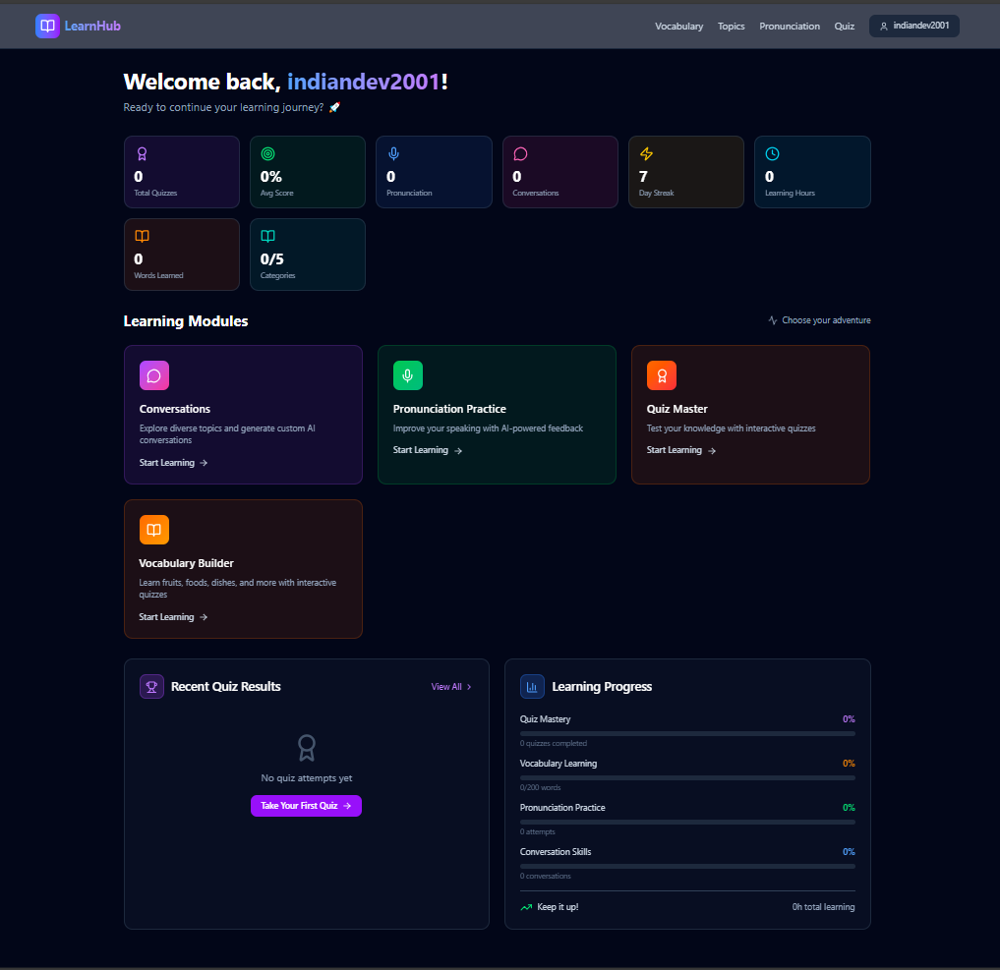

# 📚 Learn Skills - Interactive Language Learning Platform

## 🌟 Live Demo

[**View Live Demo →**](https://learn-new-skills-next-js-project.vercel.app/)



> A modern, interactive language learning platform built with Next.js that helps users master English through reading, vocabulary building, and engaging quizzes.


## ✨ Features

### 📖 Interactive Reading
- Engaging stories and articles with difficulty levels
- Word-by-word highlighting and translation
- Bookmark progress and resume anytime
- Reading comprehension tracking

### 📝 Vocabulary Builder
- Save and organize new words
- Context-based word learning
- Spaced repetition system
- Personal vocabulary collections

### 🔊 Pronunciation Practice
- Text-to-speech integration
- Listen to correct pronunciations
- Practice speaking with audio feedback
- Multiple accent support

### 📊 Progress Dashboard
- Track your learning journey
- Visual analytics and statistics
- Streak tracking and milestones
- Performance insights across all activities

### 🎯 Interactive Quizzes
- Multiple quiz types (MCQ, Fill-in-the-blanks, Matching)
- Adaptive difficulty based on performance
- Instant feedback and explanations
- Timed challenges for skill assessment

### 👤 User Authentication
- Secure login and registration
- Profile customization
- Learning preferences and settings
- Data synchronization across devices

## 🛠️ Tech Stack

### Frontend
- **[Next.js 15](https://nextjs.org/)** - React framework with App Router
- **[TypeScript](https://www.typescriptlang.org/)** - Type-safe development
- **[Tailwind CSS](https://tailwindcss.com/)** - Utility-first CSS framework
- **[shadcn/ui](https://ui.shadcn.com/)** - Beautiful UI components
- **[Lucide Icons](https://lucide.dev/)** - Modern icon library

### Backend & Database
- **[Supabase](https://supabase.com/)** - Backend as a Service
  - PostgreSQL database
  - Authentication
  - Real-time subscriptions
  - Row Level Security (RLS)

### Additional Libraries
- **[React Hook Form](https://react-hook-form.com/)** - Form management
- **Web Speech API** - Text-to-speech functionality

## 🚀 Getting Started

### Prerequisites
- Node.js 18+ installed
- npm or yarn package manager
- Supabase account ([Sign up here](https://supabase.com))

### Installation

1. **Clone the repository**
```bash
git clone https://github.com/yourusername/learn-skills.git
cd learn-skills
```

2. **Install dependencies**
```bash
npm install
# or
yarn install
```

3. **Set up environment variables**

Create a `.env.local` file in the root directory:

```env
NEXT_PUBLIC_SUPABASE_URL=your_supabase_project_url
NEXT_PUBLIC_SUPABASE_ANON_KEY=your_supabase_anon_key
```

5. **Run the development server**
```bash
npm run dev
# or
yarn dev
```

Open [http://localhost:3000](http://localhost:3000) in your browser.


## 🎨 Features in Detail

### Interactive Reading Experience
The reading module provides an immersive learning experience with:
- Click-to-translate any word
- Progress saving with bookmarks
- Difficulty-based content filtering
- Reading time tracking

### Smart Vocabulary System
- Automatic word difficulty detection
- Context preservation for each saved word
- Review scheduling based on spaced repetition
- Export vocabulary lists

### Progress Analytics
- Daily streak tracking
- Words learned counter
- Reading time statistics
- Quiz performance graphs
- Achievement badges

## 🔐 Security

- Row Level Security (RLS) enabled on all tables
- Secure authentication with Supabase Auth
- Environment variables for sensitive data
- Input validation with Zod schemas

## 🌐 Deployment

### Deploy on Vercel

1. Push your code to GitHub
2. Import project in [Vercel](https://vercel.com)
3. Add environment variables
4. Deploy!

[](https://vercel.com/new/clone?repository-url=https://github.com/yourusername/learn-skills)

## 📝 Environment Variables

| Variable | Description |
|----------|-------------|
| `NEXT_PUBLIC_SUPABASE_URL` | Your Supabase project URL |
| `NEXT_PUBLIC_SUPABASE_ANON_KEY` | Your Supabase anonymous key |


## 👤 Author

**Your Name**
- GitHub: [@Naitik-G](https://github.com/Naitik-G/Learn-New-Skills-Next.js-Project)

## 🙏 Acknowledgments

- [Next.js](https://nextjs.org/) for the amazing framework
- [Supabase](https://supabase.com/) for the backend infrastructure
- [shadcn/ui](https://ui.shadcn.com/) for the beautiful components
- [Vercel](https://vercel.com/) for hosting

## 📧 Contact

For any queries or suggestions, feel free to reach out:
- Email: kumarnaitk22@gmail.com
- Project Link: [https://github.com/yourusername/learn-skills](https://github.com/yourusername/learn-skills)

---

<div align="center">
Made with ❤️ for language learners worldwide
</div>